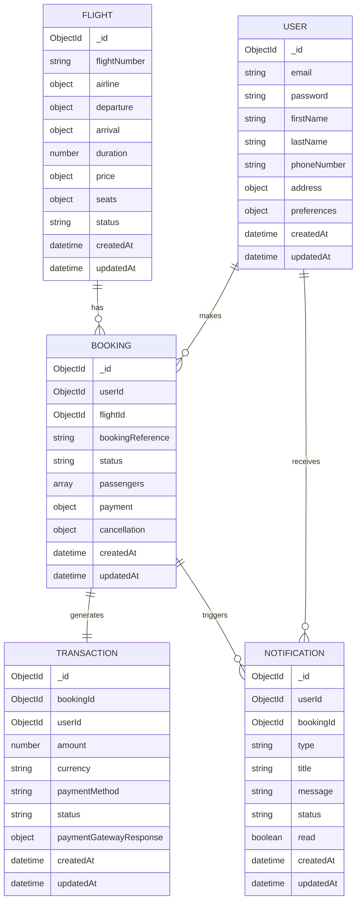

# Database ERD (Entity Relationship Diagram)

This is a simplified Entity-Relationship Diagram (ERD) representation for the Flight Booking and Reservation System in a non relational database - MongoDB.

## Entities
- User
- Flight
- Booking
- Transaction
- Notification

### 1. Users Collection
```js
User {
    _id: ObjectId
    email: String
    password: String (hashed)
    firstName: String
    lastName: String
    phoneNumber: String
    address: {
        street: String
        city: String
        state: String
        country: String
        zipCode: String
    }
    preferences: {
        seatPreference: String
        mealPreference: String
        notificationPreferences: {
            email: Boolean
            sms: Boolean
            push: Boolean
        }
    }
    createdAt: DateTime
    updatedAt: DateTime
}
```
### 2. Flights Collection

```js
Flight {
    _id: ObjectId
    flightNumber: String
    airline: {
        code: String
        name: String
    }
    departure: {
        airport: String
        city: String
        terminal: String
        time: DateTime
    }
    arrival: {
        airport: String
        city: String
        terminal: String
        time: DateTime
    }
    duration: Number
    price: {
        economy: Number
        business: Number
        first: Number
    }
    seats: {
        economy: {
            total: Number
            available: Number
        }
        business: {
            total: Number
            available: Number
        }
        first: {
            total: Number
            available: Number
        }
    }
    status: String
    createdAt: DateTime
    updatedAt: DateTime
}
```

### 3. Bookings Collection

```js
Booking {
    _id: ObjectId
    userId: ObjectId
    flightId: ObjectId
    bookingReference: String
    status: String
    passengers: [{
        firstName: String
        lastName: String
        email: String
        phoneNumber: String
        seatNumber: String
        seatClass: String
        specialRequests: String
    }]
    payment: {
        amount: Number
        currency: String
        status: String
        transactionId: String
        paymentMethod: String
    }
    cancellation: {
        cancelled: Boolean
        reason: String
        refundAmount: Number
        refundStatus: String
    }
    createdAt: DateTime
    updatedAt: DateTime
}
```

### 4. Transactions Collection

```js
Transaction {
    _id: ObjectId
    bookingId: ObjectId
    userId: ObjectId
    amount: Number
    currency: String
    paymentMethod: String
    status: String
    paymentGatewayResponse: Object
    createdAt: DateTime
    updatedAt: DateTime
}
```

### 5. Notifications Collection

```js
Notification {
    _id: ObjectId
    userId: ObjectId
    bookingId: ObjectId
    type: String
    title: String
    message: String
    status: String
    read: Boolean
    createdAt: DateTime
    updatedAt: DateTime
}
```

## Relationships

1. User to Bookings: One-to-Many
   - A user can have multiple bookings
   - Each booking belongs to one user

2. Flight to Bookings: One-to-Many
   - A flight can have multiple bookings
   - Each booking is associated with one flight

3. Booking to Transactions: One-to-One
   - Each booking has one transaction
   - Each transaction belongs to one booking

4. User to Notifications: One-to-Many
   - A user can have multiple notifications
   - Each notification belongs to one user

5. Booking to Notifications: One-to-Many
   - A booking can have multiple notifications
   - Each notification is associated with one booking


## Diagram
